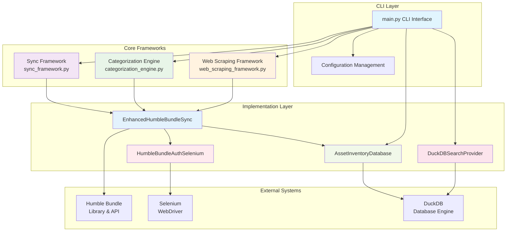
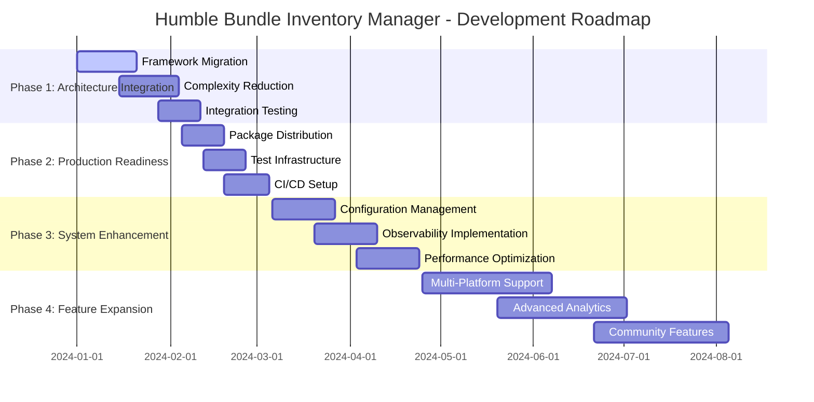

# Humble Bundle Inventory Manager

A comprehensive digital asset inventory management system for Humble Bundle purchases, featuring advanced categorization, powerful search capabilities, and extensible architecture. Successfully manages 2,922+ digital assets with confidence-based categorization and multi-format support.

## 🚀 Features

- **Automated Library Sync**: Secure authentication and complete library synchronization with HAR-based API discovery
- **Advanced Categorization**: AI-powered categorization with confidence scoring and extensible rule system
- **Powerful Search**: Full-text search, regex support, advanced filtering, and pagination
- **Rich CLI Interface**: Interactive commands with beautiful output formatting and progress tracking
- **Secure Authentication**: Session persistence with encryption and MFA support
- **Extensible Architecture**: Three core abstraction frameworks with pluggable components
- **Multi-Format Support**: Games, ebooks, audiobooks, software, comics, and more
- **DuckDB Storage**: High-performance analytical database optimized for queries

## 🏗️ System Architecture



## 📅 Development Phases & Roadmap



## 📦 Installation

```bash
pip install humble-bundle-inventory
```

## 🏃 Quick Start

```bash
# Initialize database and configuration
humble-inventory init

# Login to Humble Bundle and save credentials
humble-inventory login --save

# Synchronize your library
humble-inventory sync

# Search your collection
humble-inventory search "python programming"

# View library statistics  
humble-inventory status

# Export data
humble-inventory search "cyberpunk" --format json > results.json
```

## 💡 Usage Examples

### Basic Sync
```python
from humble_bundle_inventory import HumbleBundleAuthSelenium, AssetInventoryDatabase, EnhancedHumbleBundleSync

with HumbleBundleAuthSelenium(headless=True) as auth:
    if auth.login():
        with AssetInventoryDatabase() as db:
            sync = EnhancedHumbleBundleSync(auth, db)
            results = sync.sync_humble_bundle_enhanced()
            print(f"Synced {results['products_synced']} products")
```

### Advanced Search
```python
from humble_bundle_inventory import AssetInventoryDatabase, DuckDBSearchProvider

with AssetInventoryDatabase() as db:
    search = DuckDBSearchProvider(db.conn)
    
    # Regex search for machine learning books
    results = search.search_assets(
        r".*machine.*learning.*",
        use_regex=True,
        filters={"category": "ebook"}
    )
```

### Field-Specific Search
```bash
# Search in specific fields
humble-inventory search "python" --field developer

# Advanced multi-field search
humble-inventory advanced-search "name:python,developer:oreilly" --operator AND

# Regex search with case sensitivity
humble-inventory search "^[A-Z].*" --regex --case-sensitive
```

See [examples/](examples/) for more detailed usage patterns.

## 🏗️ Architecture

The system is built on three core abstraction frameworks designed to reduce complexity and improve maintainability:

### 1. Sync Framework (`sync_framework.py`)
Template Method pattern for standardized synchronization with pluggable components:
- **Source Extractors**: Extract data from different platforms (Humble Bundle, Steam, GOG)
- **Item Processors**: Transform and enhance raw data with categorization
- **Data Syncers**: Store processed data in various backends
- **Built-in Error Handling**: Comprehensive error handling and progress tracking

### 2. Categorization Engine (`categorization_engine.py`)
Rule-based pattern matching with confidence scoring:
- **Extensible Rules**: Custom category rules and pattern matchers
- **Confidence Metrics**: Machine learning-ready confidence scoring
- **Hierarchical Categorization**: Support for categories and subcategories
- **Multiple Strategies**: Pattern matching, ML-based, and hybrid approaches

### 3. Web Scraping Framework (`web_scraping_framework.py`)
Configuration-driven web automation:
- **Dynamic Content Loading**: Handle JavaScript-heavy pages and lazy loading
- **Reusable Patterns**: Common extraction patterns and error recovery
- **Multi-Browser Support**: Chrome, Firefox, and fallback strategies
- **Session Management**: Persistent sessions and authentication handling

## 📁 Project Structure

```
humble-bundle-inventory/
├── src/humble_bundle_inventory/     # Main package
│   ├── __init__.py                  # Package initialization and exports
│   ├── main.py                      # CLI entry point with comprehensive commands
│   ├── config.py                    # Configuration management with Pydantic
│   ├── database.py                  # DuckDB database operations and schema
│   ├── auth_selenium.py             # Selenium-based authentication
│   ├── enhanced_sync.py             # Enhanced sync with HAR insights
│   ├── working_metadata_sync.py     # Legacy sync implementation
│   ├── sync_framework.py            # Sync abstraction framework
│   ├── categorization_engine.py     # Categorization framework
│   ├── web_scraping_framework.py    # Web automation framework
│   ├── search_provider.py           # Search interface definition
│   ├── duckdb_search_provider.py    # DuckDB search implementation
│   └── schema.sql                   # Database schema definition
├── tests/                           # Comprehensive test suite
│   ├── test_basic.py               # Basic functionality tests
│   ├── test_integration.py         # Integration tests
│   ├── test_search_integration.py  # Search functionality tests
│   └── test_selenium_auth.py       # Authentication tests
├── examples/                        # Usage examples
│   ├── basic_usage.py              # Getting started examples
│   └── search_examples/            # Advanced search patterns
├── docs/                           # Documentation
│   ├── adr/                        # Architectural Decision Records
│   ├── README.md                   # Detailed documentation
│   └── search_examples.md          # Search usage examples
├── development/                    # Development and debug scripts
├── archive/                        # Historical implementations
└── pyproject.toml                  # Project configuration and dependencies
```

## 🔧 Development

### Setup Development Environment
```bash
git clone https://github.com/yourusername/humble-bundle-inventory
cd humble-bundle-inventory
pip install -e ".[dev]"
```

### Run Tests
```bash
pytest                              # Run all tests
pytest tests/unit/                  # Unit tests only
pytest tests/integration/          # Integration tests only
```

### Code Quality
```bash
black src/ tests/                   # Format code
flake8 src/ tests/                  # Lint code  
mypy src/                          # Type checking
```

### Complexity Analysis
```bash
python tests/cyclomatic_complexity.py  # Analyze code complexity
```

## 📊 Current Status

- **Assets Managed**: 2,922+ digital assets successfully extracted
- **Test Coverage**: 64% with comprehensive integration testing
- **Complexity Status**: 92 high-complexity functions identified (being addressed via frameworks)
- **Architecture**: Three abstraction frameworks implemented and operational
- **Database**: DuckDB with comprehensive schema supporting multiple sources
- **Authentication**: Production-ready with MFA support and session persistence

## 📚 Documentation

- **[Architectural Decision Records](docs/adr/)** - Design decisions and rationale
- **[Detailed Documentation](docs/README.md)** - Comprehensive usage and API reference
- **[Search Examples](docs/search_examples.md)** - Advanced search patterns and usage
- **[Examples](examples/)** - Code examples and usage patterns
- **[Complexity Analysis](docs/CYCLOMATIC_COMPLEXITY_ANALYSIS.md)** - Code quality metrics

## 🤝 Contributing

1. Read our [ADR documentation](docs/adr/) for design principles
2. Review the [complexity analysis](docs/CYCLOMATIC_COMPLEXITY_ANALYSIS.md) to understand current technical debt
3. Fork the repository
4. Create a feature branch
5. Add tests for new functionality
6. Ensure code quality checks pass
7. Submit a pull request

## 📄 License

MIT License - see [LICENSE](LICENSE) file for details.

## 🆘 Support

- **Issues**: [GitHub Issues](https://github.com/yourusername/humble-bundle-inventory/issues)
- **Discussions**: [GitHub Discussions](https://github.com/yourusername/humble-bundle-inventory/discussions)
- **Documentation**: [Project Documentation](https://github.com/yourusername/humble-bundle-inventory#readme)

## 🚧 Technical Debt & Roadmap

The project is currently addressing technical debt through the implementation of abstraction frameworks. See [ADR-002](docs/adr/002-improvement-roadmap-and-technical-debt-prioritization.md) for the detailed improvement roadmap.

**Current Priorities:**
1. **Phase 1**: Complete framework migration and complexity reduction
2. **Phase 2**: Production readiness and test coverage improvement
3. **Phase 3**: Configuration management and observability
4. **Phase 4**: Multi-platform support and advanced analytics