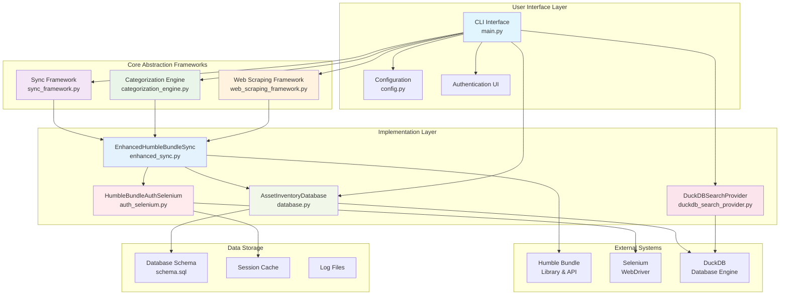
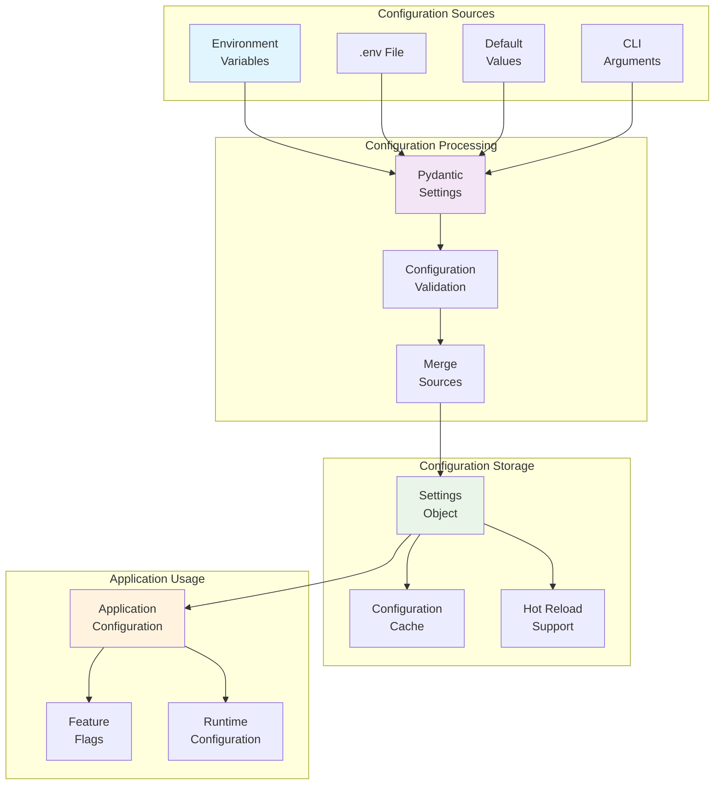
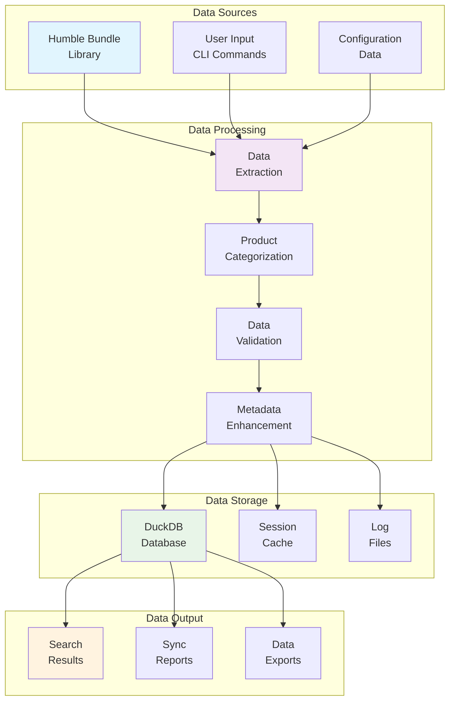
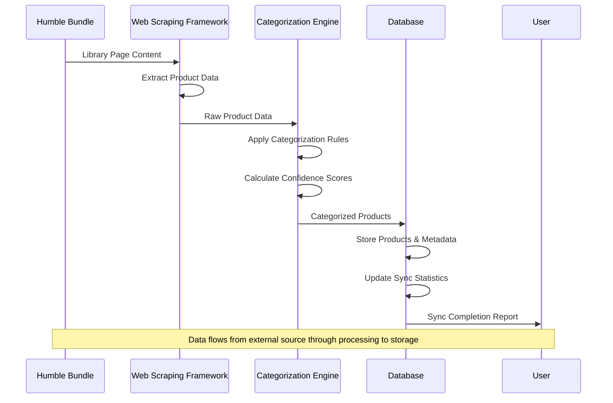
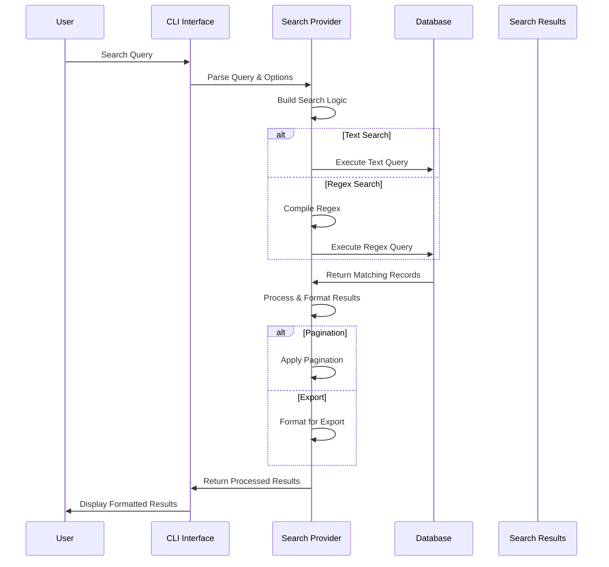
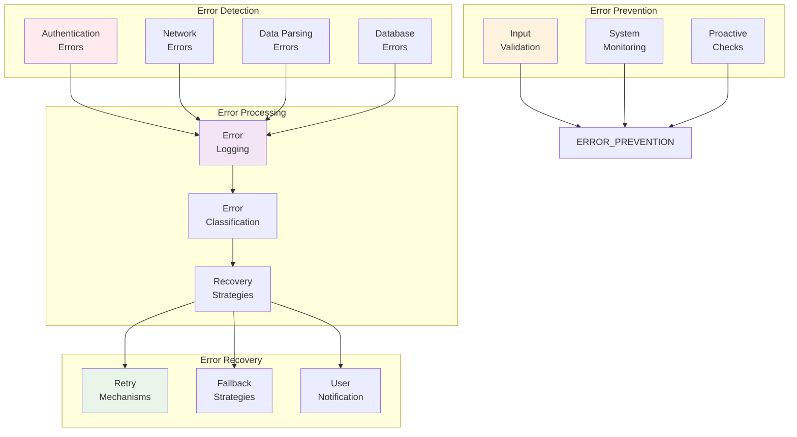
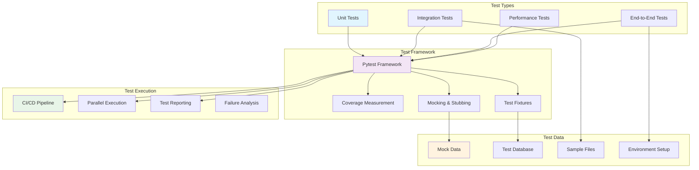
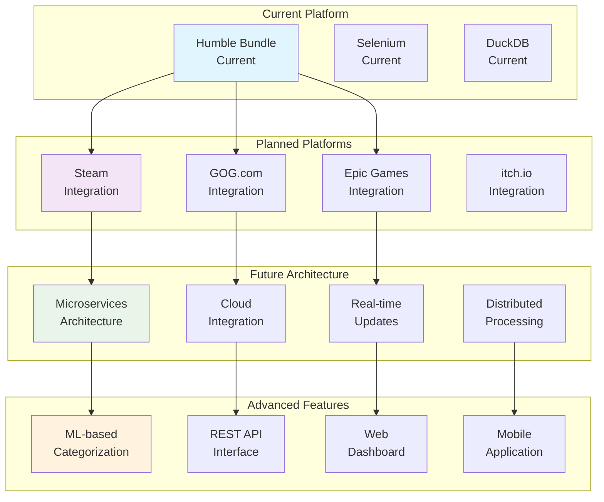

# Integration Summary

This document provides a comprehensive overview of how the Humble Bundle Inventory Manager integrates with external systems, internal components, and the overall architecture.

## 🔗 System Integration Overview

The Humble Bundle Inventory Manager is designed as a modular system with clear integration points between components. The architecture follows the principle of loose coupling and high cohesion, enabling easy extension and maintenance.

## 🏗️ Internal Component Integration

### System Integration Architecture



### Core Framework Integration

#### 1. Sync Framework Integration
The sync framework serves as the central orchestration layer for all synchronization operations:

```python
# Integration between sync framework and other components
class EnhancedHumbleBundleSync:
    def __init__(self, auth: HumbleBundleAuthSelenium, db: AssetInventoryDatabase):
        self.auth = auth          # Authentication integration
        self.db = db             # Database integration
        self.driver = None       # Web driver integration
    
    def sync_humble_bundle_enhanced(self) -> Dict[str, Any]:
        # Uses auth for authentication
        # Uses db for data storage
        # Uses web driver for data extraction
```

**Integration Points**:
- **Authentication**: Integrates with `HumbleBundleAuthSelenium` for session management
- **Database**: Integrates with `AssetInventoryDatabase` for data persistence
- **Web Scraping**: Integrates with Selenium WebDriver for data extraction
- **Categorization**: Integrates with `CategorizationEngine` for asset classification

#### 2. Categorization Engine Integration
The categorization engine integrates with multiple components to provide consistent asset classification:

```python
# Integration with sync and search components
class CategorizationEngine:
    def __init__(self):
        self.matchers = []
        self.rules = []
    
    def categorize_item(self, item: Dict[str, Any]) -> CategoryResult:
        # Integrates with pattern matchers
        # Integrates with rule system
        # Returns structured categorization results
```

**Integration Points**:
- **Sync Framework**: Provides categorization during data synchronization
- **Search System**: Enhances search results with category information
- **Database**: Stores categorization results for efficient querying
- **Rule System**: Integrates with configurable categorization rules

#### 3. Web Scraping Framework Integration
The web scraping framework provides standardized web automation capabilities:

```python
# Integration with sync and authentication components
class BaseWebScraper:
    def __init__(self, driver: webdriver.Chrome, wait_timeout: int = 10):
        self.driver = driver      # Integrates with Selenium WebDriver
        self.wait = WebDriverWait(driver, wait_timeout)
        self.extractor = WebElementExtractor()
    
    def extract_from_page(self, config: PageConfig) -> Dict[str, Any]:
        # Integrates with page configuration
        # Integrates with extraction rules
        # Integrates with error handling
```

**Integration Points**:
- **Selenium WebDriver**: Integrates with browser automation
- **Page Configuration**: Integrates with declarative page definitions
- **Extraction Rules**: Integrates with data extraction patterns
- **Error Handling**: Integrates with recovery mechanisms

### Database Integration

#### Database Schema Integration
The database integrates with all major components through a unified schema:

```sql
-- Core integration tables
CREATE TABLE asset_sources (
    source_id VARCHAR PRIMARY KEY,
    source_name VARCHAR NOT NULL,
    source_type VARCHAR NOT NULL,
    -- ... other fields
);

CREATE TABLE products (
    product_id VARCHAR PRIMARY KEY,
    source_id VARCHAR REFERENCES asset_sources(source_id),
    -- ... other fields
);

-- Integration views
CREATE VIEW searchable_assets AS
SELECT p.*, a.source_name, b.bundle_name
FROM products p
JOIN asset_sources a ON p.source_id = a.source_id
LEFT JOIN bundle_products bp ON p.product_id = bp.product_id
LEFT JOIN bundles b ON bp.bundle_id = bp.bundle_id;
```

**Integration Benefits**:
- **Unified Data Model**: Single schema for all asset types
- **Referential Integrity**: Proper foreign key relationships
- **Optimized Views**: Pre-joined data for efficient querying
- **Extensible Design**: Easy addition of new asset sources

#### Database Operations Integration
Database operations integrate seamlessly with all components:

```python
# Integration with sync, search, and categorization components
class AssetInventoryDatabase:
    def __init__(self, db_path: str = None):
        self.db_path = db_path or settings.database_path
        self.conn = None
        self._ensure_database()
    
    def upsert_product(self, product_data: Dict[str, Any]) -> bool:
        # Integrates with product data from sync
        # Integrates with categorization results
        # Integrates with metadata extraction
    
    def search_products(self, query: str, filters: Dict[str, Any]) -> List[Dict[str, Any]]:
        # Integrates with search provider interface
        # Integrates with filtering system
        # Integrates with result formatting
```

## 🌐 External System Integration

### External Integration Architecture

```mermaid
graph TB
    subgraph "Humble Bundle Integration"
        HB_AUTH[Humble Bundle<br/>Authentication]
        HB_LIBRARY[Humble Bundle<br/>Library API]
        HB_SESSION[Session<br/>Management]
    end
    
    subgraph "Selenium Integration"
        SELENIUM_DRIVER[Selenium<br/>WebDriver]
        BROWSER_AUTO[Browser<br/>Automation]
        ELEMENT_EXTRACTION[Element<br/>Extraction]
    end
    
    subgraph "DuckDB Integration"
        DUCKDB_ENGINE[DuckDB<br/>Engine]
        SQL_QUERIES[SQL<br/>Queries]
        DATA_STORAGE[Data<br/>Storage]
    end
    
    subgraph "File System Integration"
        CONFIG_FILES[Configuration<br/>Files]
        SESSION_CACHE[Session<br/>Cache]
        LOG_FILES[Log<br/>Files]
    end
    
    HB_AUTH --> HB_LIBRARY
    HB_LIBRARY --> HB_SESSION
    
    SELENIUM_DRIVER --> BROWSER_AUTO
    BROWSER_AUTO --> ELEMENT_EXTRACTION
    
    DUCKDB_ENGINE --> SQL_QUERIES
    SQL_QUERIES --> DATA_STORAGE
    
    CONFIG_FILES --> SESSION_CACHE
    SESSION_CACHE --> LOG_FILES
    
    style HB_AUTH fill:#e1f5fe
    style SELENIUM_DRIVER fill:#f3e5f5
    style DUCKDB_ENGINE fill:#e8f5e8
    style CONFIG_FILES fill:#fff3e0
```



### Humble Bundle Integration

#### Authentication Integration
The system integrates with Humble Bundle's authentication system:

```python
# Integration with Humble Bundle authentication
class HumbleBundleAuthSelenium:
    def __init__(self, headless: bool = False):
        self.headless = headless
        self.session_file = settings.session_cache_dir / "humble_session.pkl"
    
    def login(self) -> bool:
        # Integrates with Humble Bundle login page
        # Integrates with MFA system
        # Integrates with session management
    
    def has_valid_session(self) -> bool:
        # Integrates with session validation
        # Integrates with cookie management
```

**Integration Features**:
- **Login Flow**: Integrates with Humble Bundle's authentication system
- **MFA Support**: Integrates with multi-factor authentication
- **Session Management**: Integrates with session persistence
- **Cookie Handling**: Integrates with browser cookie management

#### Data Extraction Integration
The system integrates with Humble Bundle's library interface:

```python
# Integration with Humble Bundle library page
def _extract_products_from_page(self) -> List[Dict[str, Any]]:
    # Integrates with library page DOM
    # Integrates with dynamic content loading
    # Integrates with product data extraction
    # Integrates with bundle information
```

**Integration Points**:
- **Library Page**: Integrates with Humble Bundle's library interface
- **Dynamic Content**: Integrates with JavaScript-heavy pages
- **Product Data**: Integrates with product metadata extraction
- **Bundle Information**: Integrates with bundle and order data

### Selenium WebDriver Integration

#### Browser Automation Integration
The system integrates with Selenium WebDriver for web automation:

```python
# Integration with Selenium WebDriver
from selenium import webdriver
from selenium.webdriver.common.by import By
from selenium.webdriver.support.ui import WebDriverWait
from selenium.webdriver.support import expected_conditions as EC

class HumbleBundleAuthSelenium:
    def _setup_driver(self):
        # Integrates with Chrome WebDriver
        # Integrates with webdriver manager
        # Integrates with browser options
        # Integrates with proxy settings
```

**Integration Features**:
- **Browser Management**: Integrates with multiple browser types
- **Driver Management**: Integrates with webdriver manager
- **Element Interaction**: Integrates with DOM manipulation
- **Wait Strategies**: Integrates with dynamic content handling

#### Web Element Integration
The system integrates with web page elements for data extraction:

```python
# Integration with web page elements
def _wait_for_library_content(self):
    # Integrates with page load events
    # Integrates with element visibility
    # Integrates with dynamic content
    # Integrates with error conditions
```

**Integration Points**:
- **Page Loading**: Integrates with page load events
- **Element Visibility**: Integrates with element appearance
- **Dynamic Content**: Integrates with AJAX loading
- **Error Handling**: Integrates with page errors

## 🔧 Configuration Integration

### Configuration Integration Architecture



### Environment Configuration Integration
The system integrates with environment-based configuration:

```python
# Integration with environment configuration
class Settings(BaseSettings):
    # Database configuration integration
    database_path: str = "~/.humble_bundle_inventory/humble_bundle.duckdb"
    
    # Authentication configuration integration
    humble_email: Optional[str] = None
    humble_password: Optional[str] = None
    
    # Sync configuration integration
    sync_interval_hours: int = 24
    requests_per_minute: int = 30
    
    class Config:
        env_file = ".env"                    # Integrates with .env files
        env_file_encoding = "utf-8"          # Integrates with file encoding
```

**Integration Features**:
- **Environment Variables**: Integrates with system environment
- **Configuration Files**: Integrates with .env files
- **Default Values**: Integrates with sensible defaults
- **Validation**: Integrates with Pydantic validation

### File System Integration
The system integrates with the local file system:

```python
# Integration with file system
def ensure_user_directories():
    # Integrates with user home directory
    # Integrates with configuration directory
    # Integrates with database directory
    # Integrates with session cache directory
    # Integrates with log directory
```

**Integration Points**:
- **User Directories**: Integrates with user home directory
- **Configuration Storage**: Integrates with config file storage
- **Database Storage**: Integrates with database file storage
- **Session Cache**: Integrates with session file storage
- **Log Storage**: Integrates with log file storage

## 📊 Data Flow Integration

### Data Flow Architecture



### Synchronization Data Flow
The synchronization process integrates multiple data flows:



**Data Flow Integration**:
1. **Source Integration**: Humble Bundle library data extraction
2. **Processing Integration**: Web scraping and data transformation
3. **Categorization Integration**: Automatic asset classification
4. **Storage Integration**: Database persistence and indexing
5. **Search Integration**: Search index creation and maintenance

### Search Data Flow
The search system integrates with the data storage and categorization:



**Search Integration**:
1. **Query Processing**: User input parsing and validation
2. **Provider Integration**: Search provider interface implementation
3. **Database Integration**: SQL query execution and optimization
4. **Result Integration**: Result formatting and presentation
5. **Metadata Integration**: Categorization and metadata display

## 🔄 Error Handling Integration

### Error Handling Architecture



### Error Recovery Integration
The system integrates comprehensive error handling across all components:

```python
# Integration with error handling systems
def sync_humble_bundle_enhanced(self) -> Dict[str, Any]:
    try:
        # Integration with authentication error handling
        # Integration with network error handling
        # Integration with parsing error handling
        # Integration with database error handling
    except Exception as e:
        # Integration with error logging
        # Integration with error reporting
        # Integration with recovery mechanisms
        # Integration with user notification
```

**Error Handling Integration**:
- **Authentication Errors**: Integrates with login failure handling
- **Network Errors**: Integrates with connection failure handling
- **Parsing Errors**: Integrates with data extraction failure handling
- **Database Errors**: Integrates with storage failure handling
- **Recovery Mechanisms**: Integrates with automatic retry and fallback

### Logging Integration
The system integrates with comprehensive logging:

```python
# Integration with logging system
import logging

# Integration with different log levels
logging.debug("Debug information")
logging.info("Information messages")
logging.warning("Warning messages")
logging.error("Error messages")

# Integration with log formatting
# Integration with log file rotation
# Integration with log level configuration
```

**Logging Integration**:
- **Log Levels**: Integrates with configurable log levels
- **Log Formatting**: Integrates with structured log formatting
- **Log Storage**: Integrates with log file management
- **Log Rotation**: Integrates with log file rotation
- **Log Configuration**: Integrates with runtime log configuration

## 🧪 Testing Integration

### Testing Integration Architecture



### Test Framework Integration
The system integrates with comprehensive testing frameworks:

```python
# Integration with testing frameworks
import pytest
from unittest.mock import Mock, patch

# Integration with test fixtures
@pytest.fixture
def mock_database():
    # Integration with database mocking
    # Integration with test data setup
    # Integration with cleanup procedures

# Integration with test coverage
# Integration with test reporting
# Integration with CI/CD integration
```

**Testing Integration**:
- **Unit Testing**: Integrates with pytest framework
- **Mocking**: Integrates with unittest.mock
- **Fixtures**: Integrates with pytest fixtures
- **Coverage**: Integrates with coverage measurement
- **CI/CD**: Integrates with continuous integration

### Integration Testing
The system integrates with end-to-end testing:

```python
# Integration with end-to-end testing
def test_full_sync_workflow():
    # Integration with authentication testing
    # Integration with sync testing
    # Integration with search testing
    # Integration with database testing
    # Integration with error handling testing
```

**Integration Testing**:
- **Workflow Testing**: Integrates with complete user workflows
- **Component Testing**: Integrates with component interaction testing
- **Data Flow Testing**: Integrates with data flow validation
- **Error Scenario Testing**: Integrates with error condition testing
- **Performance Testing**: Integrates with performance validation

## 🔮 Future Integration Points

### Future Integration Architecture



### Planned External Integrations
The system is designed for future platform integrations:

```python
# Future integration points
class SteamIntegration:
    def __init__(self, api_key: str):
        # Integration with Steam API
        # Integration with Steam authentication
        # Integration with Steam library data

class GOGIntegration:
    def __init__(self, api_key: str):
        # Integration with GOG API
        # Integration with GOG authentication
        # Integration with GOG library data

class EpicGamesIntegration:
    def __init__(self, client_id: str):
        # Integration with Epic Games API
        # Integration with Epic Games authentication
        # Integration with Epic Games library data
```

**Future Integration Areas**:
1. **Steam Integration**: Steam library synchronization
2. **GOG Integration**: GOG library synchronization
3. **Epic Games Integration**: Epic Games Store synchronization
4. **API Interfaces**: REST API for external integrations
5. **Web Dashboard**: Web-based user interface

### Architecture Evolution Integration
The system is designed for architectural evolution:

```python
# Future architecture integration points
class MicroserviceSync:
    def __init__(self, service_url: str):
        # Integration with microservice architecture
        # Integration with service discovery
        # Integration with load balancing

class CloudStorage:
    def __init__(self, cloud_provider: str):
        # Integration with cloud storage
        # Integration with cloud databases
        # Integration with cloud authentication
```

**Architecture Evolution**:
1. **Microservices**: Integration with microservice architecture
2. **Cloud Integration**: Integration with cloud platforms
3. **Real-time Updates**: Integration with WebSocket systems
4. **Distributed Processing**: Integration with distributed systems
5. **Containerization**: Integration with container platforms

## 📚 Integration Best Practices

### Integration Guidelines
The system follows established integration best practices:

1. **Loose Coupling**: Components interact through well-defined interfaces
2. **High Cohesion**: Related functionality is grouped together
3. **Error Handling**: Comprehensive error handling and recovery
4. **Logging**: Detailed logging for debugging and monitoring
5. **Testing**: Comprehensive testing of integration points
6. **Documentation**: Clear documentation of integration interfaces
7. **Versioning**: Proper versioning of integration interfaces
8. **Backward Compatibility**: Maintain backward compatibility when possible

### Integration Testing Strategy
The integration testing strategy ensures reliable system operation:

1. **Unit Testing**: Test individual components in isolation
2. **Integration Testing**: Test component interactions
3. **End-to-End Testing**: Test complete user workflows
4. **Error Testing**: Test error conditions and recovery
5. **Performance Testing**: Test integration performance
6. **Security Testing**: Test integration security
7. **Compatibility Testing**: Test with different environments
8. **Regression Testing**: Ensure new changes don't break existing functionality

## 🔗 Related Documentation

- **[Main README](../README.md)** - Project overview and quick start
- **[Detailed Documentation](README.md)** - Comprehensive user guide
- **[Technical Documentation](TECHNICAL_DOCUMENTATION.md)** - Technical implementation details
- **[Search Examples](search_examples.md)** - Search functionality guide
- **[Architectural Decision Records](adr/)** - Design decision rationale
- **[Complexity Analysis](CYCLOMATIC_COMPLEXITY_ANALYSIS.md)** - Code quality metrics