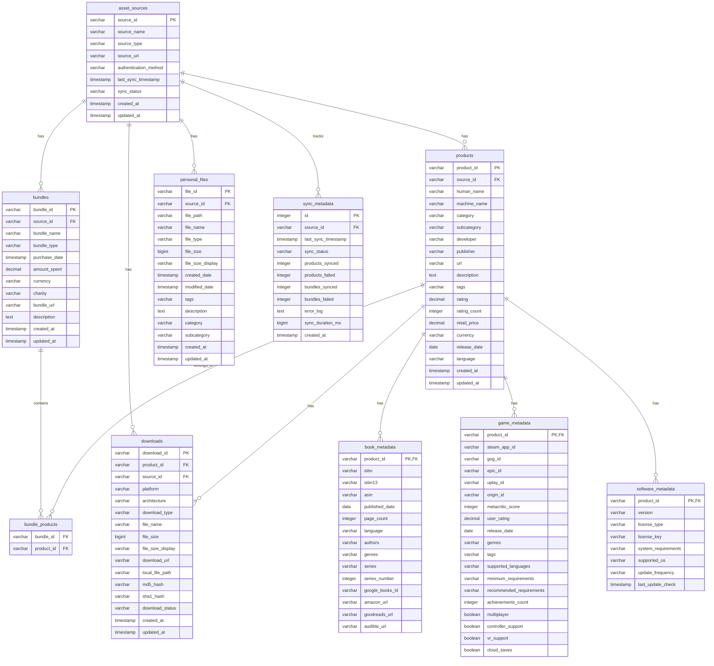

# Humble Bundle Inventory Manager - Detailed Documentation

A comprehensive digital asset inventory management system that successfully synchronizes and manages 2,922+ digital assets from Humble Bundle with advanced categorization, powerful search capabilities, and extensible architecture.

## 🎯 Overview

The Humble Bundle Inventory Manager is a Python application that synchronizes your Humble Bundle library to a local DuckDB database, enabling efficient querying, analysis, and management of your digital collection. Built with three core abstraction frameworks, it provides a robust foundation for multi-platform digital asset management.

## 🏗️ System Architecture

### High-Level Architecture


### Component Interaction Flow


## ✨ Key Features

- 🔐 **Secure Authentication**: Encrypted session storage with automatic re-authentication and MFA support
- 📚 **Multi-format Support**: Games, ebooks, audiobooks, comics, software, and more
- 🗄️ **DuckDB Storage**: High-performance analytical database optimized for complex queries
- 🔄 **Smart Sync**: Incremental synchronization with HAR-based API discovery and conflict resolution
- 📊 **Rich Analytics**: Library statistics, advanced search, and comprehensive reporting
- 🎨 **Beautiful CLI**: Rich terminal interface with progress bars, tables, and pagination
- ⚡ **Rate Limited**: Respectful API usage to avoid being blocked
- 🎯 **Confidence-based Categorization**: AI-powered categorization with extensible rule system
- 🔍 **Advanced Search**: Regex support, field-specific queries, and multi-field operations

## 🏗️ Architecture

### Three Core Abstraction Frameworks

The system is built on three core abstraction frameworks designed to reduce complexity and improve maintainability:

#### 1. Sync Framework (`sync_framework.py`)
**Architecture Pattern**: Template Method with Strategy Pattern
- **Base Class**: `BaseSyncEngine` with pluggable components
- **Components**: `SourceExtractor`, `ItemProcessor`, `DataSyncer` protocols
- **Factory**: `SyncEngineFactory` for creating configured engines

**Key Benefits**:
- Reduces complexity from 34.5 to ~8-10
- Enables easy addition of Steam, GOG, Epic Game Store
- Standardizes error handling and categorization

#### 2. Categorization Engine (`categorization_engine.py`)
**Architecture Pattern**: Strategy Pattern with Rule Engine
- **Core Class**: `CategorizationEngine` with multiple matchers
- **Rule System**: `CategoryRule` with pattern matching and weights
- **Confidence Scoring**: `CategoryResult` with confidence metrics

**Key Benefits**:
- Centralizes all categorization logic
- Supports extensible rules and ML integration
- Provides consistent confidence scoring across all sources

#### 3. Web Scraping Framework (`web_scraping_framework.py`)
**Architecture Pattern**: Template Method with Configuration-Driven Approach
- **Base Class**: `BaseWebScraper` with common automation patterns
- **Configuration**: `PageConfig` and `ExtractionRule` for declarative scraping
- **Session Management**: `ScrapingSession` for multi-page workflows

**Key Benefits**:
- Standardizes page extraction patterns
- Reduces error-prone DOM manipulation code
- Enables configuration-driven scraping

### Framework Class Relationships


## 🚀 Quick Start

### 1. Installation
```bash
pip install humble-bundle-inventory
```

### 2. Initialize Database and Configuration
```bash
humble-inventory init
```

### 3. Login to Humble Bundle
```bash
humble-inventory login --email your@email.com --save
```

### 4. Synchronize Your Library
```bash
humble-inventory sync
```

### 5. Search Your Collection
```bash
humble-inventory search "python programming"
```

## 📋 Command Reference

### Authentication Commands

#### Login
```bash
# Login with email and password
humble-inventory login --email your@email.com --save

# Login with saved credentials
humble-inventory login

# Force new login even if session exists
humble-inventory login --force-new
```

#### Session Management
```bash
# Check session status
humble-inventory session

# Logout and clear session
humble-inventory logout
```

### Synchronization Commands

#### Sync Library
```bash
# Standard sync (respects sync interval)
humble-inventory sync

# Force sync regardless of interval
humble-inventory sync --force

# Use enhanced sync with HAR insights (default)
humble-inventory sync --enhanced

# Use legacy sync (not recommended)
humble-inventory sync --legacy
```

#### Status and Information
```bash
# View sync status and library statistics
humble-inventory status

# Show status of all asset sources
humble-inventory sources

# Show configuration and file locations
humble-inventory config
```

### Search Commands

#### Basic Search
```bash
# Simple text search
humble-inventory search "cyberpunk"

# Search with filters
humble-inventory search "python" --category ebook --source humble_bundle

# Regex search
humble-inventory search "^[A-Z].*" --regex

# Case-sensitive regex search
humble-inventory search "Python" --regex --case-sensitive
```

#### Field-Specific Search
```bash
# Search in specific field
humble-inventory search "oreilly" --field developer

# Search with multiple filters
humble-inventory search "game" --category game --rating-min 4.0
```

#### Advanced Search
```bash
# Multi-field search with AND operator
humble-inventory advanced-search "name:python,developer:oreilly" --operator AND

# Multi-field search with OR operator
humble-inventory advanced-search "name:cyberpunk,genre:rpg" --operator OR

# Advanced search with regex
humble-inventory advanced-search "name:.*game.*,category:game" --regex
```

#### Search Results
```bash
# Paginated results (default)
humble-inventory search "python" --page 1 --page-size 20

# Dump all results in specific format
humble-inventory search "cyberpunk" --dump --format json
humble-inventory search "python" --dump --format csv
humble-inventory search "game" --dump --format tsv
```

### Utility Commands

#### Database Management
```bash
# Initialize database
humble-inventory init

# Show file locations
humble-inventory --show-paths

# Show search capabilities
humble-inventory search-info
```

## 🗄️ Database Schema

### Schema Overview



### Key Design Principles

#### 1. Source Agnostic
- All tables reference `asset_sources` for platform identification
- Common schema supports Humble Bundle, Steam, GOG, and personal files
- Extensible for future platforms

#### 2. Normalized Structure
- Products and bundles are separate entities
- Many-to-many relationship between bundles and products
- Metadata stored in specialized tables for performance

#### 3. Search Optimization
- Strategic indexes on frequently queried fields
- Views for common query patterns
- JSON storage for flexible metadata (tags, genres, etc.)

### Database Operations

#### Connection Management
```python
class AssetInventoryDatabase:
    def __init__(self, db_path: str = None):
        self.db_path = db_path or settings.database_path
        self.conn = None
        self._ensure_database()
    
    def _ensure_database(self):
        """Initialize database connection and create tables if needed."""
        self.conn = duckdb.connect(self.db_path)
        self._create_tables()
```

#### Schema Creation
- Automatic table creation on first run
- SQL schema loaded from `schema.sql` file
- Statements executed in dependency order (tables → indexes → data → views)

## ⚙️ Configuration

### Environment Variables

Edit `.env` file or set environment variables:

| Variable | Default | Description |
|----------|---------|-------------|
| `HUMBLE_EMAIL` | - | Your Humble Bundle email |
| `HUMBLE_PASSWORD` | - | Your Humble Bundle password |
| `DATABASE_PATH` | `humble_bundle.duckdb` | Database file location |
| `SYNC_INTERVAL_HOURS` | `24` | Hours between automatic syncs |
| `REQUESTS_PER_MINUTE` | `30` | Rate limit for API requests |
| `LOG_LEVEL` | `INFO` | Logging verbosity |

### File Locations

The application creates and manages several directories:

- **Database**: `~/.humble_bundle_inventory/humble_bundle.duckdb`
- **Configuration**: `~/.humble_bundle_inventory/`
- **Session Cache**: `~/.humble_bundle_inventory/.session_cache/`
- **Logs**: `~/.humble_bundle_inventory/logs/`

## 🔍 Advanced Usage

### Querying the Database

You can directly query the DuckDB database using any SQL client or Python:

```python
import duckdb

# Connect to database
conn = duckdb.connect('~/.humble_bundle_inventory/humble_bundle.duckdb')

# Example queries
games = conn.execute("""
    SELECT human_name, developer, bundle_name 
    FROM products p
    JOIN bundle_products bp ON p.product_id = bp.product_id
    JOIN bundles b ON bp.bundle_id = bp.bundle_id
    WHERE category = 'game'
    ORDER BY human_name
""").fetchall()

# Books by genre
books = conn.execute("""
    SELECT p.human_name, bm.authors, bm.genres
    FROM products p
    JOIN book_metadata bm ON p.product_id = bm.product_id
    WHERE 'fantasy' = ANY(bm.genres)
""").fetchall()
```

### Automated Sync

Set up automated synchronization using cron:

```bash
# Add to crontab (sync every 6 hours)
0 */6 * * * cd /path/to/humblebundle && humble-inventory sync

# Sync daily at 2 AM
0 2 * * * humble-inventory sync
```

### Custom Categorization Rules

Extend the categorization engine with custom rules:

```python
from humble_bundle_inventory import CategorizationEngine, CategoryRule

# Create custom rule
custom_rule = CategoryRule(
    name="Python Programming Books",
    category="ebook",
    subcategory="programming",
    patterns=["python", "programming", "coding"],
    weight=0.8,
    field_weights={"name": 0.6, "description": 0.4}
)

# Add to engine
engine = CategorizationEngine()
engine.add_rule(custom_rule)
```

## 📊 Performance and Optimization

### DuckDB Advantages
- **Analytical Queries**: Optimized for complex aggregations and joins
- **Columnar Storage**: Efficient for large datasets and analytical workloads
- **Indexing**: Strategic indexes for common query patterns
- **Memory Management**: Intelligent memory usage and caching

### Search Optimization
- **Field Indexing**: Primary fields indexed for fast retrieval
- **Regex Optimization**: Compiled patterns for efficient matching
- **Result Caching**: Cached results for repeated queries
- **Pagination**: Efficient handling of large result sets

### Sync Performance
- **Incremental Updates**: Only processes changed data
- **Batch Operations**: Efficient database operations
- **Rate Limiting**: Respects API limits and server resources
- **Error Recovery**: Graceful handling of network issues

## 🛡️ Data Privacy & Security

- **Credentials**: Stored encrypted using Fernet (cryptography library)
- **Sessions**: Encrypted and cached locally, auto-expire after 24 hours  
- **Network**: All requests use HTTPS with proper headers
- **Local Only**: No data is transmitted to third-party services
- **MFA Support**: Full support for Humble Bundle's multi-factor authentication

## 🚧 Current Status and Roadmap

### Current Achievements
- **Assets Managed**: 2,922+ digital assets successfully extracted
- **Test Coverage**: 64% with comprehensive integration testing
- **Architecture**: Three abstraction frameworks implemented and operational
- **Database**: DuckDB with comprehensive schema supporting multiple sources
- **Authentication**: Production-ready with MFA support and session persistence

### Technical Debt Status
- **Complexity Status**: 92 high-complexity functions identified (being addressed via frameworks)
- **Framework Migration**: In progress - reducing complexity from 34.5 to ~8-10
- **Test Coverage**: Target: 85%+ (currently 64%)

### Improvement Roadmap


#### Phase 1: Architecture Integration (Critical)
- Complete framework migration and complexity reduction
- Integrate existing sync classes with new abstraction frameworks
- Achieve 60%+ complexity improvement in affected modules

#### Phase 2: Production Readiness (High)
- Create production-ready pip package
- Achieve comprehensive test coverage (85%+)
- Enhance test infrastructure and CI/CD

#### Phase 3: System Enhancement (Medium)
- Centralize configuration management
- Implement comprehensive logging and observability
- Add health checks and system diagnostics

#### Phase 4: Feature Expansion (Lower)
- Multi-platform support (Steam, GOG, Epic Games Store)
- Advanced analytics and recommendation engine
- Community contribution guidelines

## 🔧 Troubleshooting

### Common Issues

**Authentication Issues:**
- Clear session cache: `rm -rf ~/.humble_bundle_inventory/.session_cache`
- Try logging in again: `humble-inventory login`
- Check MFA settings in Humble Bundle account

**Sync Failures:**
- Check network connection and firewall settings
- Verify Humble Bundle credentials
- Review logs: `tail -f ~/.humble_bundle_inventory/logs/humble_sync.log`
- Try force sync: `humble-inventory sync --force`

**Database Issues:**
- Reinitialize database: `humble-inventory init`
- Check disk space and permissions
- Verify DuckDB installation: `python -c "import duckdb; print(duckdb.__version__)"`

**Search Issues:**
- Check database initialization: `humble-inventory init`
- Verify sync completion: `humble-inventory status`
- Test basic search: `humble-inventory search "test"`

### Debug Mode

Enable verbose logging for troubleshooting:

```bash
# Set log level
export LOG_LEVEL=DEBUG

# Run commands with verbose output
humble-inventory sync --verbose
```

## 🤝 Contributing

### Development Setup
1. Fork the repository
2. Clone and set up development environment
3. Install development dependencies: `pip install -e ".[dev]"`
4. Run tests: `pytest`
5. Check code quality: `black src/ tests/ && flake8 src/ tests/`

### Contribution Guidelines
1. Read our [ADR documentation](docs/adr/) for design principles
2. Review the [complexity analysis](docs/CYCLOMATIC_COMPLEXITY_ANALYSIS.md) to understand current technical debt
3. Follow the established code patterns and architecture
4. Add comprehensive tests for new functionality
5. Ensure all code quality checks pass
6. Update documentation for new features

### Areas for Contribution
- **Framework Migration**: Help migrate existing code to new abstraction frameworks
- **Test Coverage**: Improve test coverage and add new test cases
- **Documentation**: Enhance user guides and API documentation
- **Performance**: Optimize database queries and search operations
- **New Features**: Implement additional platform support or analytics features

## 📄 License

MIT License - see [LICENSE](../LICENSE) file for details.

## ⚠️ Disclaimer

This tool is for personal use only. It respects Humble Bundle's terms of service by:
- Using rate limiting and respectful API usage
- Not redistributing content
- Only accessing your own library
- Not bypassing security measures

Use responsibly and in accordance with Humble Bundle's terms of service.

## 📚 Additional Resources

- **[Architectural Decision Records](adr/)** - Design decisions and rationale
- **[Search Examples](search_examples.md)** - Advanced search patterns and usage
- **[Examples](../examples/)** - Code examples and usage patterns
- **[Complexity Analysis](CYCLOMATIC_COMPLEXITY_ANALYSIS.md)** - Code quality metrics
- **[Integration Summary](INTEGRATION_SUMMARY.md)** - System integration details
- **[Technical Documentation](TECHNICAL_DOCUMENTATION.md)** - Technical implementation details