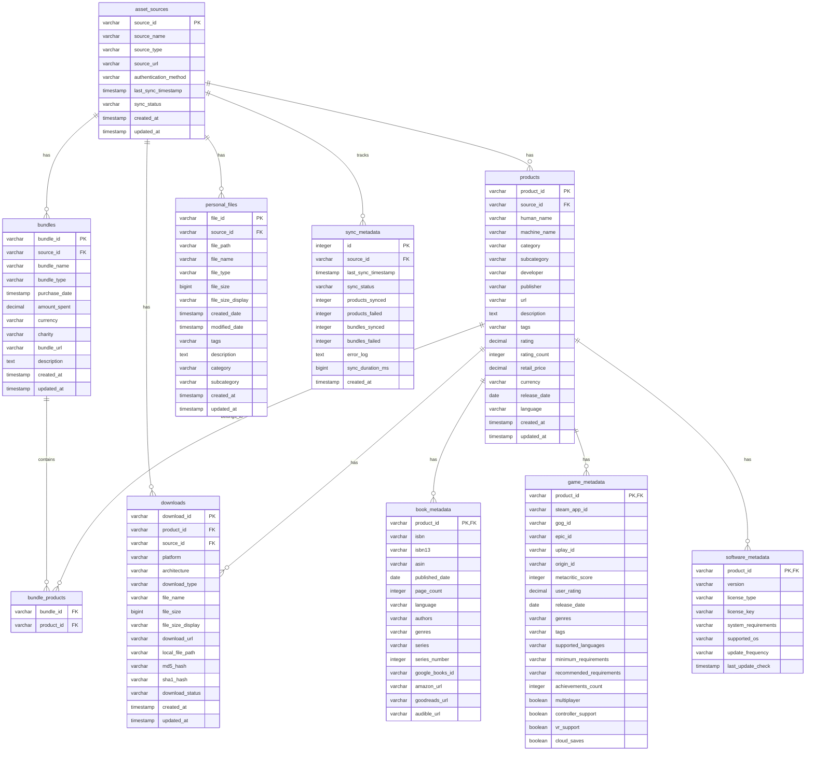

# Technical Documentation

This document provides comprehensive technical details about the Humble Bundle Inventory Manager implementation, including architecture, database design, API interfaces, and development guidelines.

## 🏗️ System Architecture

### High-Level System Architecture


### Component Interaction Architecture


### Framework Responsibilities

The system is built on three core abstraction frameworks designed to reduce complexity and improve maintainability:

#### 1. Sync Framework (`sync_framework.py`)
**Architecture Pattern**: Template Method with Strategy Pattern
- **Base Class**: `BaseSyncEngine` with pluggable components
- **Components**: `SourceExtractor`, `ItemProcessor`, `DataSyncer` protocols
- **Factory**: `SyncEngineFactory` for creating configured engines

**Key Benefits**:
- Reduces complexity from 34.5 to ~8-10
- Enables easy addition of Steam, GOG, Epic Game Store
- Standardizes error handling and categorization

#### 2. Categorization Engine (`categorization_engine.py`)
**Architecture Pattern**: Strategy Pattern with Rule Engine
- **Core Class**: `CategorizationEngine` with multiple matchers
- **Rule System**: `CategoryRule` with pattern matching and weights
- **Confidence Scoring**: `CategoryResult` with confidence metrics

**Key Benefits**:
- Centralizes all categorization logic
- Supports extensible rules and ML integration
- Provides consistent confidence scoring across all sources

#### 3. Web Scraping Framework (`web_scraping_framework.py`)
**Architecture Pattern**: Template Method with Configuration-Driven Approach
- **Base Class**: `BaseWebScraper` with common automation patterns
- **Configuration**: `PageConfig` and `ExtractionRule` for declarative scraping
- **Session Management**: `ScrapingSession` for multi-page workflows

**Key Benefits**:
- Standardizes page extraction patterns
- Reduces error-prone DOM manipulation code
- Enables configuration-driven scraping

### Framework Class Relationships


## 🗄️ Database Design

### Database Schema Architecture



### Database Operations Flow


### Key Design Principles

#### 1. Source Agnostic
- All tables reference `asset_sources` for platform identification
- Common schema supports Humble Bundle, Steam, GOG, and personal files
- Extensible for future platforms

#### 2. Normalized Structure
- Products and bundles are separate entities
- Many-to-many relationship between bundles and products
- Metadata stored in specialized tables for performance

#### 3. Search Optimization
- Strategic indexes on frequently queried fields
- Views for common query patterns
- JSON storage for flexible metadata (tags, genres, etc.)

### Database Operations

#### Connection Management
```python
class AssetInventoryDatabase:
    def __init__(self, db_path: str = None):
        self.db_path = db_path or settings.database_path
        self.conn = None
        self._ensure_database()
    
    def _ensure_database(self):
        """Initialize database connection and create tables if needed."""
        self.conn = duckdb.connect(self.db_path)
        self._create_tables()
```

#### Schema Creation
- Automatic table creation on first run
- SQL schema loaded from `schema.sql` file
- Statements executed in dependency order (tables → indexes → data → views)

## 🔐 Authentication System

### Authentication Flow Architecture


### Selenium-Based Authentication
The system uses Selenium WebDriver for Humble Bundle authentication:

```python
class HumbleBundleAuthSelenium:
    def __init__(self, headless: bool = False):
        self.headless = headless
        self.driver = None
        self.session_file = settings.session_cache_dir / "humble_session.pkl"
    
    def login(self) -> bool:
        """Authenticate with Humble Bundle."""
        # Implementation details...
    
    def has_valid_session(self) -> bool:
        """Check if existing session is still valid."""
        # Implementation details...
```

### Session Management
- **Encrypted Storage**: Sessions stored using Fernet encryption
- **Automatic Renewal**: Sessions auto-refresh when possible
- **MFA Support**: Full support for multi-factor authentication
- **Fallback Handling**: Graceful degradation when authentication fails

### Security Features
- **Credential Encryption**: Passwords encrypted before storage
- **Session Isolation**: Separate session files per user
- **HTTPS Enforcement**: All requests use secure connections
- **Rate Limiting**: Respectful API usage to avoid blocking

## 🔄 Synchronization Engine

### Sync Process Architecture


### Enhanced Sync Implementation
The primary sync engine uses HAR analysis insights for enhanced metadata extraction:

```python
class EnhancedHumbleBundleSync:
    def __init__(self, auth: HumbleBundleAuthSelenium, db: AssetInventoryDatabase):
        self.auth = auth
        self.db = db
        self.driver = None
        self.user_data = None
        self.api_data = {}
    
    def sync_humble_bundle_enhanced(self) -> Dict[str, Any]:
        """Enhanced sync extracting products directly from the library page."""
        # Implementation details...
```

### Sync Process Flow
1. **Authentication**: Verify or establish Humble Bundle session
2. **Navigation**: Navigate to library page with dynamic content handling
3. **Extraction**: Extract product data using configured selectors
4. **Processing**: Categorize and enhance extracted data
5. **Storage**: Store processed data in DuckDB database
6. **Metadata**: Record sync statistics and error logs

### Error Handling and Recovery
- **Network Resilience**: Automatic retry with exponential backoff
- **Partial Success**: Continue processing on individual item failures
- **Error Logging**: Comprehensive error tracking and reporting
- **Graceful Degradation**: Fallback to alternative extraction methods

## 🔍 Search System

### Search Architecture Overview


### Search Provider Interface
Abstract interface for search implementations:

```python
class SearchProvider(ABC):
    @abstractmethod
    def search_assets(self, query: str, filters: Optional[Dict[str, Any]] = None,
                     use_regex: bool = False, case_sensitive: bool = False) -> List[Dict[str, Any]]:
        """Search assets using text or regex patterns."""
        pass
    
    @abstractmethod
    def search_by_field(self, field: str, query: str, use_regex: bool = False,
                       case_sensitive: bool = False, filters: Optional[Dict[str, Any]] = None) -> List[Dict[str, Any]]:
        """Search assets by specific field."""
        pass
```

### DuckDB Implementation
Concrete implementation using DuckDB's SQL capabilities:

```python
class DuckDBSearchProvider(SearchProvider):
    def __init__(self, db_connection: duckdb.DuckDBPyConnection):
        self.conn = db_connection
        self.searchable_fields = [
            'human_name', 'description', 'category', 'subcategory', 
            'developer', 'publisher', 'tags', 'bundle_name'
        ]
    
    def search_assets(self, query: str, filters: Optional[Dict[str, Any]] = None,
                     use_regex: bool = False, case_sensitive: bool = False) -> List[Dict[str, Any]]:
        """Search assets using text or regex patterns."""
        if use_regex:
            return self._search_with_regex(query, filters, case_sensitive)
        else:
            return self._search_with_text(query, filters)
```

### Search Features
- **Regex Support**: Full regex pattern matching with compilation
- **Field-Specific Search**: Search within specific database fields
- **Advanced Search**: Multi-field queries with AND/OR operators
- **Filtering**: Category, source, platform, and rating filters
- **Pagination**: Efficient handling of large result sets
- **Export Formats**: JSON, CSV, TSV, and table output

## 🎯 Categorization System

### Categorization Architecture


### Rule-Based Categorization
The categorization engine uses pattern matching with confidence scoring:

```python
@dataclass
class CategoryRule:
    name: str
    category: CategoryType
    subcategory: str
    patterns: List[str]
    weight: float
    field_weights: Dict[str, float]
    required_patterns: List[str] = None
    exclusion_patterns: List[str] = None

@dataclass
class CategoryResult:
    category: CategoryType
    subcategory: str
    confidence: float
    method: str
    matched_rules: List[str]
    scores: Dict[str, float]
```

### Categorization Process
1. **Pattern Compilation**: Pre-compile regex patterns for performance
2. **Rule Matching**: Apply rules with field-specific weights
3. **Confidence Scoring**: Calculate confidence based on pattern matches
4. **Result Selection**: Choose category with highest confidence
5. **Fallback Handling**: Default categorization for low-confidence results

### Extensibility
- **Custom Rules**: Add new categorization patterns
- **Weight Adjustment**: Fine-tune categorization accuracy
- **ML Integration**: Ready for machine learning-based categorization
- **Hierarchical Support**: Categories and subcategories

## 🌐 Web Scraping Framework

### Web Scraping Architecture


### Configuration-Driven Approach
The framework uses declarative configuration for web scraping:

```python
@dataclass
class PageConfig:
    url: str
    wait_selectors: List[str]
    extraction_rules: List[ExtractionRule]
    javascript_setup: Optional[str] = None
    scroll_to_load: bool = False
    wait_time: float = 3.0

@dataclass
class ExtractionRule:
    name: str
    selector: str
    attribute: Optional[str] = None
    regex_pattern: Optional[str] = None
    required: bool = True
    multiple: bool = False
```

### Automation Patterns
- **Dynamic Content**: Handle JavaScript-heavy pages
- **Lazy Loading**: Scroll to trigger content loading
- **Error Recovery**: Graceful handling of element failures
- **Session Management**: Persistent browser sessions

## ⚙️ Configuration Management

### Configuration Architecture


### Pydantic Settings
Configuration managed using Pydantic with environment variable support:

```python
class Settings(BaseSettings):
    # Database configuration
    database_path: str = "~/.humble_bundle_inventory/humble_bundle.duckdb"
    
    # Authentication configuration
    humble_email: Optional[str] = None
    humble_password: Optional[str] = None
    
    # Sync configuration
    sync_interval_hours: int = 24
    requests_per_minute: int = 30
    
    # Logging configuration
    log_level: str = "INFO"
    
    class Config:
        env_file = ".env"
        env_file_encoding = "utf-8"
```

### Environment Variables
- **HUMBLE_EMAIL**: Humble Bundle account email
- **HUMBLE_PASSWORD**: Humble Bundle account password
- **DATABASE_PATH**: Custom database file location
- **LOG_LEVEL**: Logging verbosity (DEBUG, INFO, WARNING, ERROR)

### File System Integration
The system integrates with the local file system:

```python
# Integration with file system
def ensure_user_directories():
    # Integrates with user home directory
    # Integrates with configuration directory
    # Integrates with database directory
    # Integrates with session cache directory
    # Integrates with log directory
```

**Integration Points**:
- **User Directories**: Integrates with user home directory
- **Configuration Storage**: Integrates with config file storage
- **Database Storage**: Integrates with database file storage
- **Session Cache**: Integrates with session file storage
- **Log Storage**: Integrates with log file storage

## 📊 Performance and Optimization

### Performance Architecture


### DuckDB Advantages
- **Analytical Queries**: Optimized for complex aggregations and joins
- **Columnar Storage**: Efficient for large datasets and analytical workloads
- **Indexing**: Strategic indexes for common query patterns
- **Memory Management**: Intelligent memory usage and caching

### Search Optimization
- **Field Indexing**: Primary fields indexed for fast retrieval
- **Regex Optimization**: Compiled patterns for efficient matching
- **Result Caching**: Cached results for repeated queries
- **Pagination**: Efficient handling of large result sets

### Sync Performance
- **Incremental Updates**: Only processes changed data
- **Batch Operations**: Efficient database operations
- **Rate Limiting**: Respects API limits and server resources
- **Error Recovery**: Graceful handling of network issues

## 🧪 Testing Strategy

### Testing Architecture


### Test Coverage
Current test coverage: **64%** with comprehensive integration testing

### Test Types
- **Unit Tests**: Individual component testing
- **Integration Tests**: End-to-end workflow testing
- **Authentication Tests**: Login and session management
- **Search Tests**: Search functionality validation
- **Sync Tests**: Synchronization process validation

### Test Framework
- **Pytest**: Primary testing framework
- **Coverage**: Test coverage measurement
- **Mocking**: External dependency isolation
- **Fixtures**: Reusable test data and setup

## 🚧 Technical Debt Status

### Technical Debt Overview


### Current Issues
- **High Complexity**: 92 high-complexity functions identified
- **Framework Migration**: In progress - reducing complexity from 34.5 to ~8-10
- **Test Coverage**: Target: 85%+ (currently 64%)

### Improvement Areas
1. **Framework Integration**: Complete migration to abstraction frameworks
2. **Complexity Reduction**: Refactor high-complexity functions
3. **Test Enhancement**: Improve test coverage and quality
4. **Performance Optimization**: Database and search optimization
5. **Error Handling**: Comprehensive error handling and recovery

### Success Metrics
- **Complexity Reduction**: 60%+ improvement in affected modules
- **Test Coverage**: Achieve 85%+ coverage
- **Performance**: <10% overhead from abstraction layers
- **Maintainability**: Reduced code duplication and complexity

## 🔮 Future Enhancements

### Planned Features
1. **Multi-Platform Support**: Steam, GOG, Epic Games Store integration
2. **Advanced Analytics**: Spending analysis and recommendation engine
3. **Machine Learning**: ML-based categorization and insights
4. **API Interface**: REST API for external integrations
5. **Web Dashboard**: Web-based user interface

### Architecture Evolution
1. **Microservices**: Potential migration to microservices architecture
2. **Cloud Integration**: Cloud-based storage and processing
3. **Real-time Sync**: WebSocket-based real-time updates
4. **Distributed Processing**: Multi-node processing for large libraries

## 📚 Development Guidelines

### Code Quality Standards
- **Black**: Code formatting
- **Flake8**: Linting and style checking
- **MyPy**: Type checking
- **Pytest**: Testing framework

### Architecture Principles
1. **SOLID Principles**: Single responsibility, open/closed, etc.
2. **DRY Principle**: Don't repeat yourself
3. **Separation of Concerns**: Clear module boundaries
4. **Dependency Injection**: Loose coupling between components

### Documentation Standards
- **Docstrings**: Comprehensive function and class documentation
- **Type Hints**: Python type annotations
- **Examples**: Usage examples in documentation
- **Architecture Decision Records**: Documented design decisions

## 🔗 Related Documentation

- **[Main README](../README.md)** - Project overview and quick start
- **[Detailed Documentation](README.md)** - Comprehensive user guide
- **[Search Examples](search_examples.md)** - Search functionality guide
- **[Architectural Decision Records](adr/)** - Design decision rationale
- **[Complexity Analysis](CYCLOMATIC_COMPLEXITY_ANALYSIS.md)** - Code quality metrics
- **[Integration Summary](INTEGRATION_SUMMARY.md)** - System integration details 