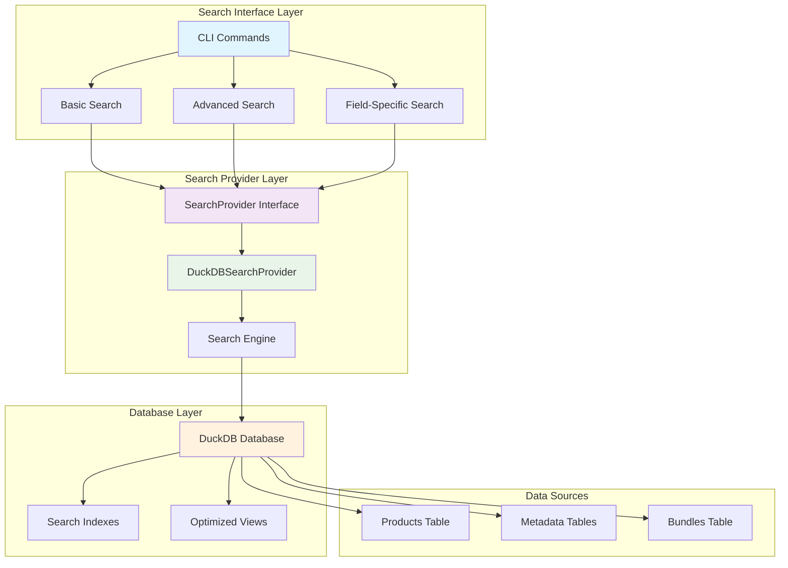
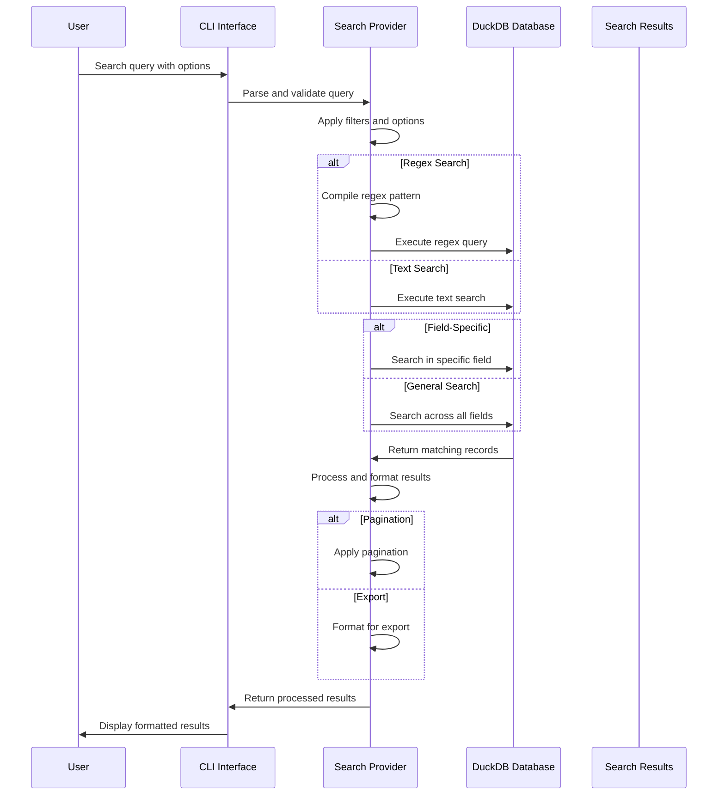
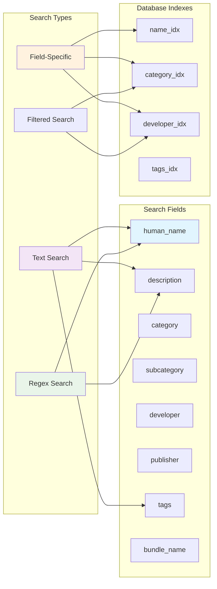
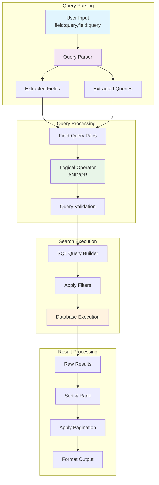
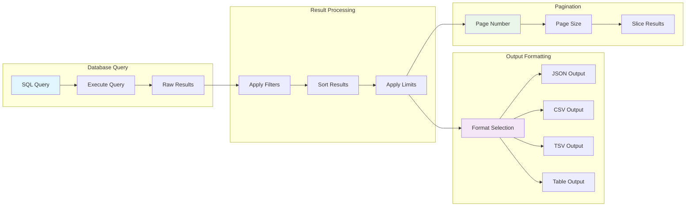
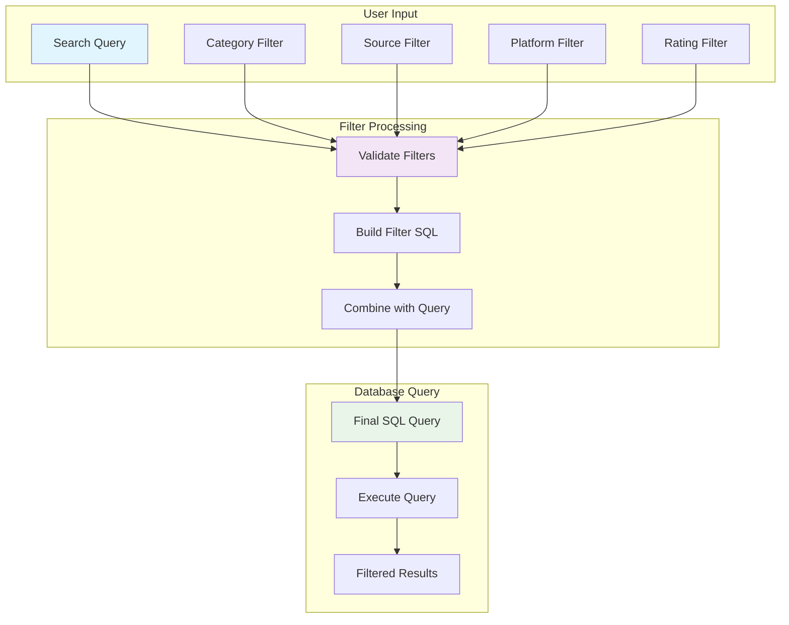
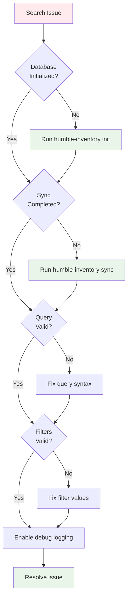

# Search Examples and Advanced Usage

This document provides comprehensive examples of the search capabilities in the Humble Bundle Inventory Manager, including basic search, advanced search, regex patterns, and field-specific queries.

## 🔍 Search Overview

The system provides multiple search interfaces with different levels of complexity:

- **Basic Search**: Simple text and regex search across all searchable fields
- **Field-Specific Search**: Search within specific fields with filtering
- **Advanced Search**: Multi-field queries with logical operators
- **Filtered Search**: Apply category, source, platform, and rating filters

## 🏗️ Search Architecture

### Search System Components



### Search Data Flow



## 📚 Basic Search Commands

### Simple Text Search
```bash
# Search for products containing "python"
humble-inventory search "python"

# Search for games with "cyberpunk" theme
humble-inventory search "cyberpunk"

# Search for books by "oreilly"
humble-inventory search "oreilly"
```

### Regex Search
```bash
# Find products starting with capital letters
humble-inventory search "^[A-Z].*" --regex

# Find products ending with "game"
humble-inventory search ".*game$" --regex

# Find products with numbers in the name
humble-inventory search ".*[0-9].*" --regex

# Case-sensitive regex search
humble-inventory search "Python" --regex --case-sensitive
```

### Search with Filters
```bash
# Search for ebooks only
humble-inventory search "programming" --category ebook

# Search in specific source
humble-inventory search "game" --source humble_bundle

# Search by platform
humble-inventory search "software" --platform windows

# Search by rating range
humble-inventory search "book" --rating-min 4.0 --rating-max 5.0
```

## 🎯 Field-Specific Search

### Search in Specific Fields
```bash
# Search in product names only
humble-inventory search "python" --field human_name

# Search in developer names
humble-inventory search "oreilly" --field developer

# Search in descriptions
humble-inventory search "machine learning" --field description

# Search in categories
humble-inventory search "rpg" --field category
```

### Available Searchable Fields
The system supports searching in these fields:
- `human_name` - Product display name
- `description` - Product description
- `category` - Main category (game, ebook, software, etc.)
- `subcategory` - Subcategory (rpg, programming, cooking, etc.)
- `developer` - Developer or author name
- `publisher` - Publisher or company
- `tags` - Product tags and keywords
- `bundle_name` - Associated bundle name

### Field Search Architecture



## 🚀 Advanced Search

### Multi-Field Queries
```bash
# Search for Python books by O'Reilly (AND operator)
humble-inventory advanced-search "name:python,developer:oreilly" --operator AND

# Search for cyberpunk games OR RPG games (OR operator)
humble-inventory advanced-search "genre:cyberpunk,genre:rpg" --operator OR

# Complex multi-field search
humble-inventory advanced-search "name:python,category:ebook,rating:4.0" --operator AND
```

### Advanced Search with Regex
```bash
# Regex search in multiple fields
humble-inventory advanced-search "name:.*game.*,category:game" --regex

# Case-sensitive regex search
humble-inventory advanced-search "name:Python,developer:O.*" --regex --case-sensitive
```

### Advanced Search Syntax
The advanced search uses the format: `field:query,field:query`
- **Field**: One of the searchable fields listed above
- **Query**: Text or regex pattern to search for
- **Operator**: `AND` (default) or `OR` to combine multiple queries

### Advanced Search Logic



## 📊 Search Results and Output

### Pagination
```bash
# View first page with 20 results (default)
humble-inventory search "python" --page 1 --page-size 20

# View second page with 10 results per page
humble-inventory search "game" --page 2 --page-size 10

# Custom page size
humble-inventory search "book" --page-size 50
```

### Export Results
```bash
# Export all results as JSON
humble-inventory search "cyberpunk" --dump --format json > cyberpunk_games.json

# Export as CSV for spreadsheet analysis
humble-inventory search "python" --dump --format csv > python_books.csv

# Export as TSV (tab-separated values)
humble-inventory search "oreilly" --dump --format tsv > oreilly_books.tsv

# Export as simple table format
humble-inventory search "game" --dump --format table > games.txt
```

### Output Formats
- **JSON**: Structured data for programmatic use
- **CSV**: Comma-separated values for spreadsheet applications
- **TSV**: Tab-separated values for text processing
- **Table**: Simple text format for documentation

### Result Processing Pipeline



## 🔧 Search Filters

### Category Filters
```bash
# Filter by main category
humble-inventory search "python" --category ebook
humble-inventory search "game" --category game
humble-inventory search "tool" --category software

# Available categories: game, ebook, audiobook, software, comic, video, audio, document
```

### Source Filters
```bash
# Filter by source platform
humble-inventory search "book" --source humble_bundle
humble-inventory search "game" --source steam
humble-inventory search "software" --source gog

# Available sources depend on your configured platforms
```

### Platform Filters
```bash
# Filter by platform
humble-inventory search "game" --platform windows
humble-inventory search "software" --platform mac
humble-inventory search "ebook" --platform universal

# Available platforms: windows, mac, linux, android, ios, ebook, audio, universal
```

### Rating Filters
```bash
# Filter by minimum rating
humble-inventory search "book" --rating-min 4.0

# Filter by maximum rating
humble-inventory search "game" --rating-max 3.5

# Filter by rating range
humble-inventory search "software" --rating-min 3.0 --rating-max 4.5
```

### Filter Application Logic



## 📝 Search Examples by Use Case

### Finding Programming Books
```bash
# Find Python programming books
humble-inventory search "python" --category ebook

# Find books by specific publisher
humble-inventory search "oreilly" --field publisher

# Find books with specific topics
humble-inventory search "machine learning" --category ebook

# Find books by author
humble-inventory search "martin fowler" --field developer
```

### Finding Games
```bash
# Find RPG games
humble-inventory search "rpg" --category game

# Find games by developer
humble-inventory search "cd projekt" --field developer

# Find games with specific themes
humble-inventory search "cyberpunk" --category game

# Find games by genre
humble-inventory search "strategy" --field subcategory
```

### Finding Software
```bash
# Find development tools
humble-inventory search "development" --category software

# Find software by platform
humble-inventory search "tool" --category software --platform windows

# Find software by developer
humble-inventory search "adobe" --field developer
```

### Finding Bundles
```bash
# Find products in specific bundles
humble-inventory search "humble book bundle" --field bundle_name

# Find recent purchases
humble-inventory search "2024" --field bundle_name

# Find charity bundles
humble-inventory search "charity" --field bundle_name
```

## 🔍 Advanced Search Patterns

### Complex Regex Patterns
```bash
# Find products with version numbers
humble-inventory search "v[0-9]+\.[0-9]+" --regex

# Find products with specific naming patterns
humble-inventory search "^[A-Z][a-z]+ [A-Z][a-z]+$" --regex

# Find products with special characters
humble-inventory search ".*[&@#$%].*" --regex

# Find products with specific word boundaries
humble-inventory search "\\bgame\\b" --regex
```

### Multi-Criteria Searches
```bash
# Find high-rated Python books by O'Reilly
humble-inventory advanced-search "name:python,developer:oreilly,rating:4.0" --operator AND

# Find games that are either RPGs or strategy games
humble-inventory advanced-search "subcategory:rpg,subcategory:strategy" --operator OR

# Find software for Windows with high ratings
humble-inventory advanced-search "category:software,platform:windows,rating:4.0" --operator AND
```

### Search Pattern Examples

```mermaid
graph TB
    subgraph "Simple Patterns"
        EXACT[Exact Match<br/>"python"]
        CONTAINS[Contains<br/>"machine learning"]
        STARTS[Starts With<br/>"^cyber"]
        ENDS[Ends With<br/>"game$"]
    end
    
    subgraph "Regex Patterns"
        VERSION[Version Numbers<br/>v[0-9]+\\.[0-9]+]
        WORD_BOUND[Word Boundaries<br/>\\bgame\\b]
        SPECIAL[Special Characters<br/>.*[&@#$%].*]
        COMPLEX[Complex Patterns<br/>^[A-Z][a-z]+ [A-Z][a-z]+$]
    end
    
    subgraph "Multi-Field"
        AND[AND Operator<br/>name:python,dev:oreilly]
        OR[OR Operator<br/>genre:rpg,genre:strategy]
        COMBINED[Combined<br/>name:.*game.*,cat:game]
    end
    
    subgraph "Filtered"
        CATEGORY[Category Filter<br/>--category ebook]
        SOURCE[Source Filter<br/>--source humble_bundle]
        RATING[Rating Filter<br/>--rating-min 4.0]
        PLATFORM[Platform Filter<br/>--platform windows]
    end
    
    style EXACT fill:#e1f5fe
    style VERSION fill:#f3e5f5
    style AND fill:#e8f5e8
    style CATEGORY fill:#fff3e0
```

## 📊 Search Statistics and Information

### View Search Capabilities
```bash
# Show search statistics and capabilities
humble-inventory search-info
```

This command displays:
- Total products and bundles in the database
- Available searchable fields
- Category and source distribution
- Search examples and usage patterns

### Search Performance Tips
1. **Use specific fields** when you know where to search
2. **Combine filters** to narrow down results
3. **Use regex sparingly** - it's more resource-intensive
4. **Export large result sets** instead of browsing through pages
5. **Use advanced search** for complex multi-field queries

## 🚧 Troubleshooting Search Issues

### Common Problems
```bash
# No results found
humble-inventory search "nonexistent"  # Check spelling and try broader terms

# Search not working
humble-inventory init                  # Ensure database is initialized
humble-inventory status               # Check if sync has been performed

# Regex errors
humble-inventory search "[" --regex   # Escape special regex characters
```

### Debug Search Queries
```bash
# Enable verbose logging
export LOG_LEVEL=DEBUG

# Run search with debug output
humble-inventory search "test" --verbose
```

### Search Troubleshooting Flow



## 🔗 Related Commands

- `humble-inventory status` - View library statistics
- `humble-inventory sources` - Check source synchronization status
- `humble-inventory config` - View configuration and file locations
- `humble-inventory search-info` - View search capabilities and statistics

## 📚 Additional Resources

- **[Main Documentation](README.md)** - Comprehensive system documentation
- **[Command Reference](README.md#command-reference)** - Complete CLI command list
- **[Database Schema](README.md#database-schema)** - Database structure and relationships
- **[Architecture Overview](README.md#architecture)** - System design and frameworks 